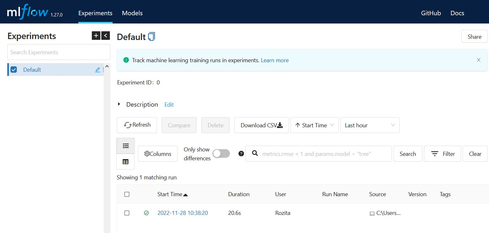
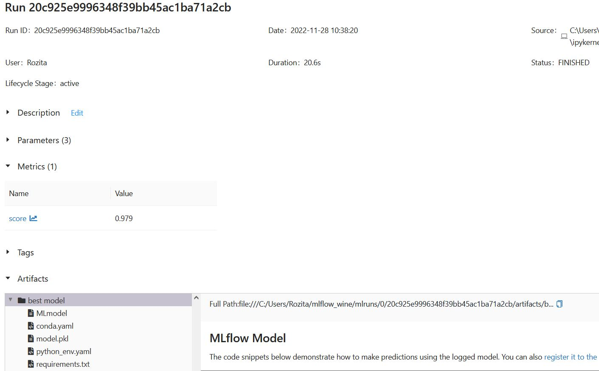

# Machine Learning Experiment Tracking with MLflow
I this project I used MLFlow to organize Sklearn Gridsearch results of the Red Wine Quality datast. MLflow is an open-source platform to manage Machine Learning Lifecycle. This means it has components to monitor your model during training and running and store data, parameters, and metrics. 

The MLflow web interface can be accessed at http://localhost:5000. 

```
mlflow ui
``` 
</br>

</br>
</br>
</br>
</br>
